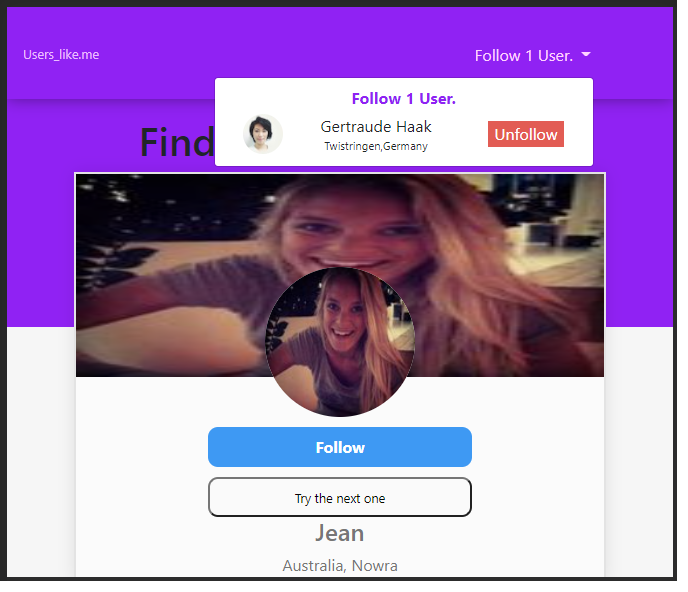
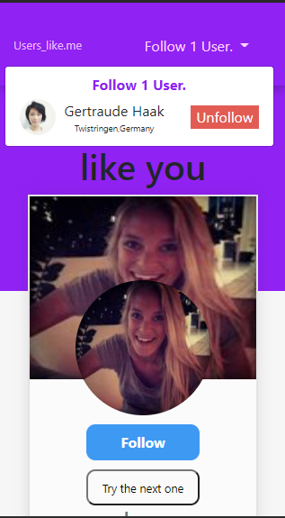

<h1>
Challenge B2W 
</h1>

<h1 align="center">    

</h1>

<h1 align="center">    

</h1>

# Sobre

O projeto **Challenge B2W** é uma aplicação client-side. que rode de forma consistente nos navegadores mais recentes e que seja responsiva para melhor visualização em dispositivos móveis.


# Fonte 

Afim de colocar em prática meu conhecimento e meus estudos, peguei o  **Challenge B2W** a qual já estavam as regras de negócio. o desafio é correspondente a uma aplicação para vaga de desenvolvedor front-end o link do desafio é
https://github.com/b2w-marketplace/challenge-front . 


# Tecnologias que serão utilizadas

O projeto está sendo desenvolvido com as seguintes tecnologias:
- Angular 
- Ngx Bootstrap 
 

 # Resumo 
 A aplicação é uma rede social, aplicada com conceito mobile first, onde o primeiro perfil a aparecer é o do desenvolvedor, é possível seguir cada perfil, caso o perfil esteje sendo seguido, na caixinha no canto inferior direito, aparecerá todos os úsuarios que estão sendo seguidos e também um botão com a possibilidade de deixar de seguir aquele perfil, note que se o perfil já estiver sendo seguido não há possibilidade de segui-lo novamente e o botão de Follow ficará destacado em vermelho. 

 Utilizando conceitos de navegação entre componentes (input e output) onde pelo tamanho da aplicação e suas regras de negócio não precisava ser aplicado controle de estado com NgRx. 
 
 Em toda a aplicação foi utilizada a metodologia BEM como organizador do código do SCSS. 

 A aplicação foi desenvolvida sem nenhuma documentação do xd ou figma. 
  
...


# Como baixar o projeto 

```bash

# clonar o repositório 
$ https://github.com/cleitonosilva/Challenge-B2W

# entrar no diretório 

$ cd b2w-challenge

# instalar as dependências 

$ npm install 

# iniciar o projeto

$ ng serve 

```


# Contato
Desenvolvido por Cleiton Oliveira
- telefone: 21 - 964099980
- emails: cleiton.o.dev@gmail.com / cleiton.logistica@outlook.com
- LinkedIn: https://www.linkedin.com/in/cleiton-silva-8637b983/

